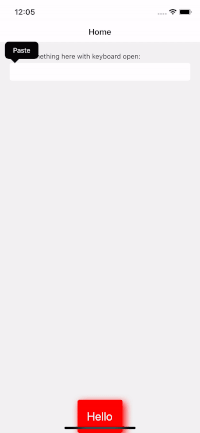

# react-native-rooster

An elegant Toast solution for react-native apps. Built using Typescript, hooks and context with multiplatform support: Android, iOS, Expo, MacOS and Windows.

  

## 📚 Docs

Check out the docs [here](https://mcodex.dev/react-native-rooster) for installation and usage instructions

Pull requests are always welcome ❤️